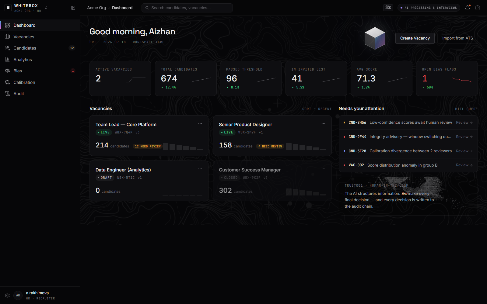
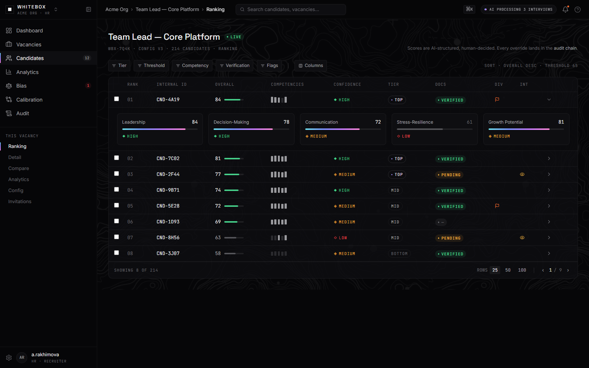
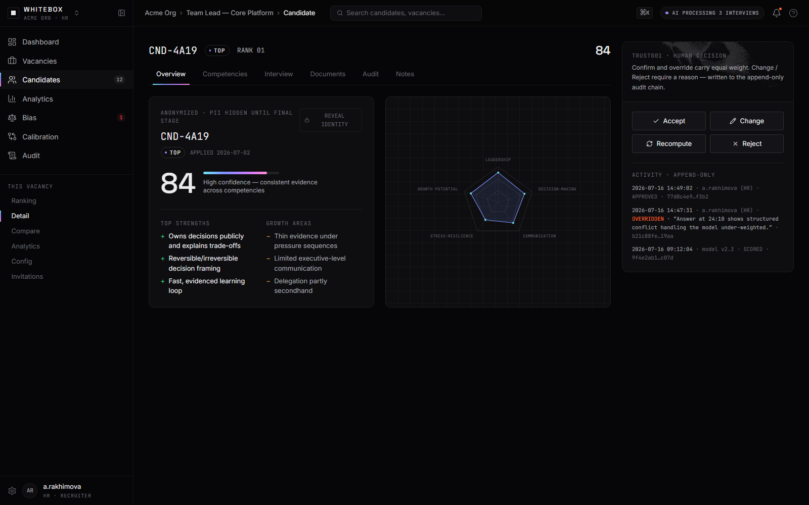
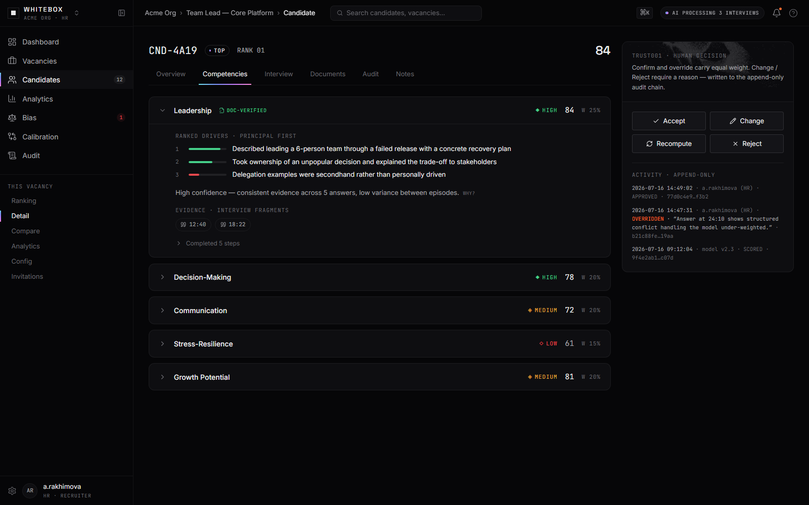
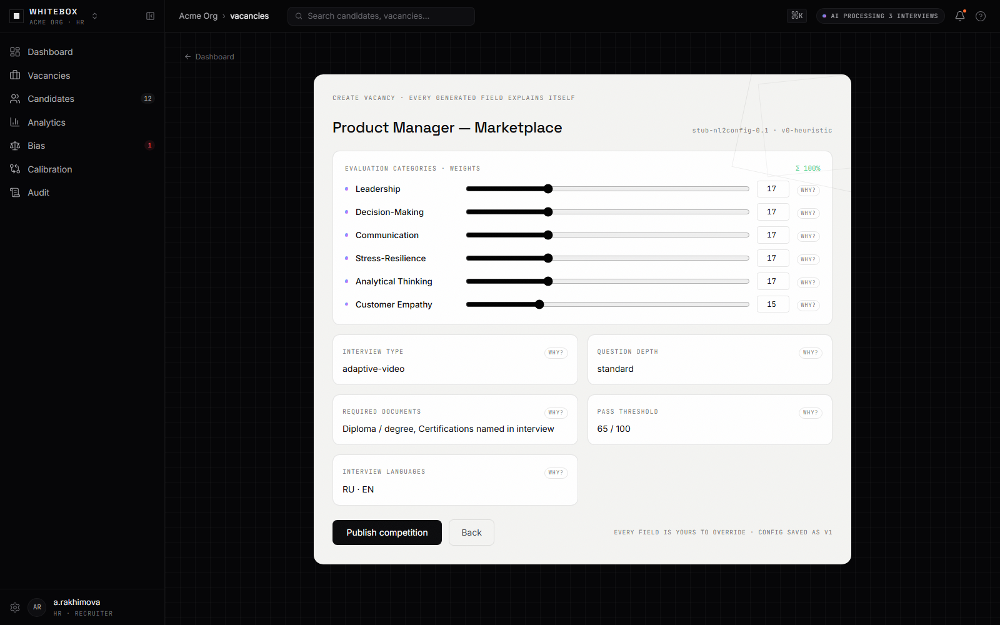
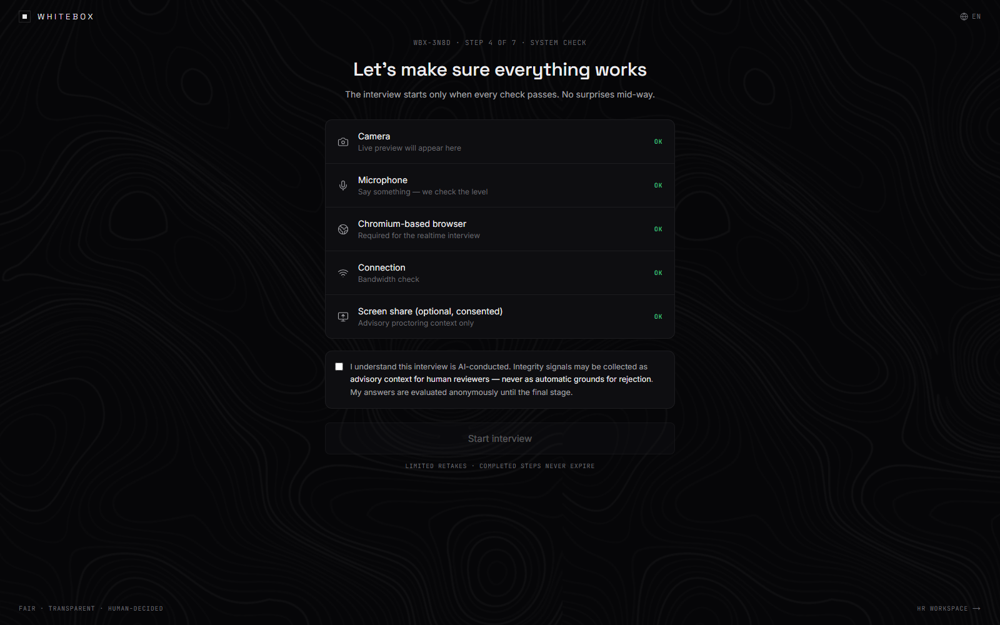
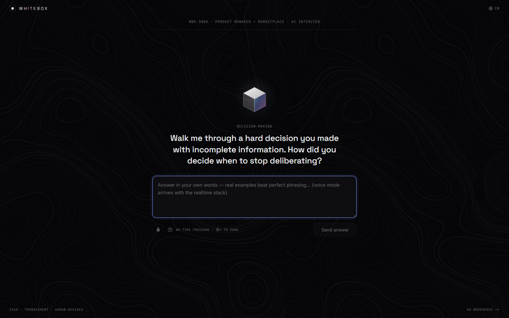
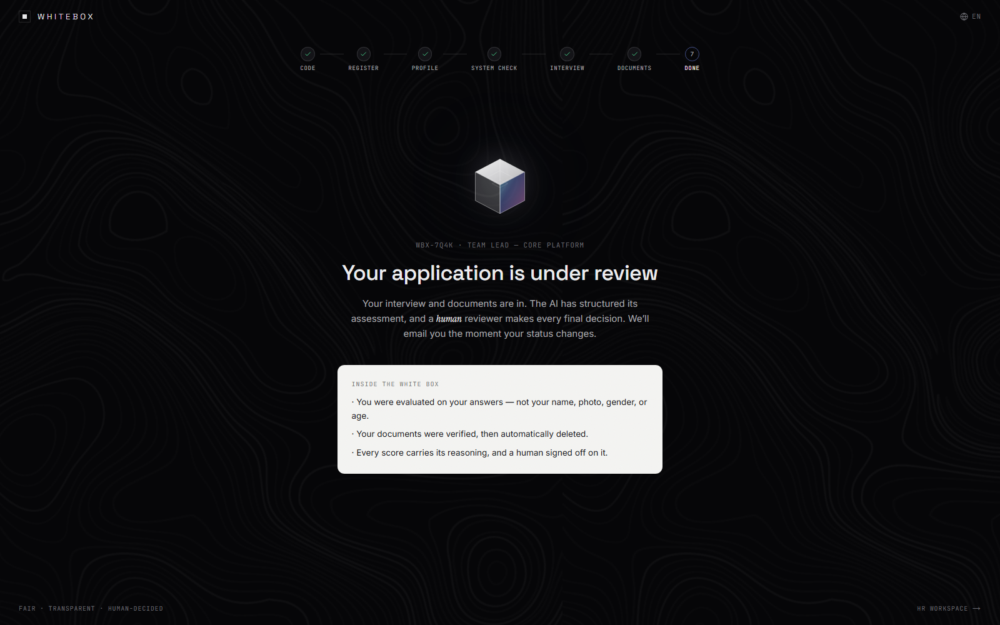
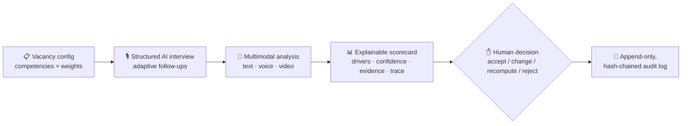

# ⬜ WhiteBox AI

### Explainable AI Hiring Operating System

*"Vertical AI, built for fair hiring. Not a faster black box — a white one you can see into."*

 

---

## 🕳 The problem

Companies receive **hundreds to thousands of applications per role** and cope with AI/ATS screening
that decides who ever reaches a human — as a **black box**:

- ❌ Candidates never learn *why* they were rejected.
- ❌ Recruiters can't see *which factors* drove a score.
- ❌ Different LLMs rank identical résumés differently — and hidden bias gets **replicated, not corrected**.
- ❌ Résumé keywords dominate, while leadership, critical thinking and communication are barely assessed.
- ❌ Regulators now treat hiring AI as **high-risk** (EU AI Act, NYC Local Law 144), yet companies have
  no auditable way to prove fair screening.

## 💡 The answer

WhiteBox AI is a **two-sided platform for the first screening stage**. The AI never makes the final
decision — it *structures information*; **the human decides**. Every score arrives fully explained:

| | What every score ships with |
|---|---|
| 🥇 | **Ranked drivers** — the top factors that pushed the score up or down, modeled on the FICO/VantageScore *reason-code* approach — the only legally tested pattern of explainable adverse action |
| 🗣 | **Confidence as a phrase**, not a bare number |
| 🧾 | **Evidence chips** — every claim linked to actual interview fragments |
| 🔍 | **Collapsible reasoning trace** — the full path from answer to score |
| ✋ | **Mandatory human exit** — accept / change / recompute / reject-with-reason, written to an **append-only, hash-chained audit log** |

> When any design decision is ambiguous, the tie-breaker is:
> **does this make the reasoning more visible and more contestable?**

---

## 🖥 The product

### HR side — a dense, keyboard-first instrument

| Candidate ranking | Explainable scorecard |
|---|---|
|  |  |

| Per-competency evidence | Vacancy wizard (NL → config) |
|---|---|
|  |  |

### Candidate side — calm, transparent, dignified

| System check | AI interview | Status & trust panel |
|---|---|---|
|  |  |  |

---

## ⚙️ How it works

- **Anti-abuse** mechanisms against generative-AI misuse, plus document verification.
- **Organizational-psychology methods** for competencies beyond résumé keywords.
- **Bias monitoring** (Fairlearn/Aequitas) and GDPR-grade data lifecycle designed in from day one.

## 🎨 Design language

A **white, transparent, glowing cube** — light passes through = explainability in one image.
Dark near-black canvas, white-on-top dominance, and **invertible "white-box" panels** for trust
moments. Elevation is 1 px hairlines, numbers are tabular, labels are mono HUD. Two registers:
HR = dense instrument · candidate = calm reassurance.

## 🧱 Architecture

**Prototype:** Next.js 15 (App Router) · TypeScript · Tailwind · token-driven design system ·
typed AI contracts (swap stubs → real pipeline with zero UI change).

**Target stack:** FastAPI AI core · PostgreSQL + pgvector · Redis · Temporal workflows
(interview → transcription → scoring → explainability) · Claude / GPT-4-class LLMs with task-based
routing, open models via vLLM for data residency · LangGraph · Instructor · Langfuse · WorkOS.

## 🗺 Roadmap

- [x] **P0 — Foundation:** design tokens, app shell, ⌘K palette, white-box primitive
- [x] **P1 — Core differentiator:** ranking, explainable scorecard, HITL + hash-chained audit log
- [ ] **P2 — Configuration:** competency builder, onboarding, full interview flow
- [ ] **P3 — Real AI pipeline:** transcription, scoring, bias monitoring
- [ ] **P4 — Polish:** 3D glowing-cube hero, motion system, hardening

---

**Status:** working MVP in active development · **Founded in** Astana, Kazakhstan 🇰🇿

*Source code is private while the MVP is under active development — this repository is the public project overview.*

